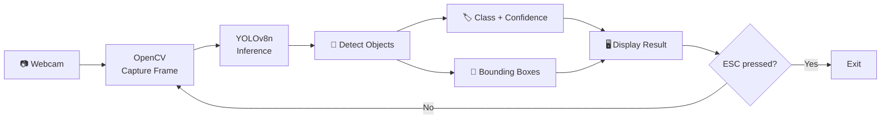

<div align="center">

# 👁️ VisionGuard

### Real-Time Object Detection using YOLOv8 and OpenCV

**Detect and label everyday objects from your webcam in real time with Python.**

</div>

---

## 📑 Table of Contents

- [Overview](#-overview)
- [Demo](#-demo)
- [Features](#-features)
- [Tech Stack](#️-tech-stack)
- [How It Works](#-how-it-works)
- [Project Structure](#-project-structure)
- [Getting Started](#-getting-started)
- [Usage](#️-usage)
- [Code Walkthrough](#-code-walkthrough)
- [Model Details](#-model-details)
- [Customization](#-customization)
- [Performance Tips](#-performance-tips)
- [Troubleshooting](#-troubleshooting)
- [Use Cases](#-use-cases)
- [Roadmap](#️-roadmap)
- [FAQ](#-faq)
- [Contributing](#-contributing)
- [License & Acknowledgements](#-license--acknowledgements)
- [Author](#-author)

---

## 📖 Overview

**VisionGuard** is a lightweight computer vision project that performs **real-time object detection** using a live webcam feed.

The project combines:

- **YOLOv8** from Ultralytics for object detection
- **OpenCV** for webcam capture, frame processing, and displaying results

Each webcam frame is passed through the pretrained **YOLOv8 Nano (`yolov8n.pt`)** model. Detected objects are displayed with bounding boxes, class names, and confidence scores.

VisionGuard also prints the unique objects detected in each frame to the terminal.

### Why VisionGuard?

The project is designed to provide a simple introduction to real-time object detection without requiring model training or a custom dataset.

```text
Webcam → OpenCV → YOLOv8 → Object Detection → Visualization
```

---

## 🎥 Demo

> 📸 **Add your project screenshot or GIF here.**

Once you capture a screenshot or demo GIF, place it inside an `assets` folder and use:

```markdown

```

### Example Console Output

```text
Detected: ['person']
Detected: ['person', 'cell phone']
Detected: ['person', 'cell phone', 'cup']
Detected: []
```

---

## ✨ Features

| Feature | Description |
|---|---|
| ⚡ **Real-Time Detection** | Processes webcam frames continuously |
| 📷 **Webcam Integration** | Uses OpenCV to access the default camera |
| 🔲 **Bounding Boxes** | Highlights detected objects |
| 🏷️ **Labels & Confidence** | Displays object names and confidence scores |
| 🖥️ **Console Logging** | Prints detected object names |
| 🧠 **80 COCO Classes** | Supports objects included in the pretrained COCO model |
| 🪶 **Lightweight Model** | Uses YOLOv8 Nano for efficient inference |
| ⌨️ **Simple Controls** | Press `ESC` to exit |

---

## 🛠️ Tech Stack

| Technology | Purpose |
|---|---|
| **Python 3.8+** | Core programming language |
| **Ultralytics YOLOv8** | Object detection and inference |
| **OpenCV** | Webcam capture and visualization |
| **YOLOv8n** | Pretrained detection model |
| **COCO Dataset** | Dataset used to train the pretrained model |

---

## 🔄 How It Works



### Detection Pipeline

1. **Load the model**  
   `YOLO("yolov8n.pt")` loads the pretrained YOLOv8 Nano model.

2. **Open the webcam**  
   `cv2.VideoCapture(0)` connects to the default camera.

3. **Capture frames**  
   Each iteration reads a frame from the webcam.

4. **Run inference**  
   The frame is passed to YOLOv8 for object detection.

5. **Identify objects**  
   Detected class IDs are converted into readable object names.

6. **Annotate the frame**  
   Bounding boxes, labels, and confidence scores are rendered.

7. **Display the result**  
   OpenCV displays the processed frame.

8. **Exit**  
   Pressing `ESC` stops the application and releases the webcam.

---

## 📁 Project Structure

```text
Real-Time-Object-Detection-Using-YOLOv8-and-OpenCV/
│
├── main.py          # Webcam capture and YOLOv8 detection loop
├── yolov8n.pt       # Pretrained YOLOv8 Nano model
├── .gitignore       # Git ignored files
└── README.md        # Project documentation
```

---

## 🚀 Getting Started

### Prerequisites

| Requirement | Details |
|---|---|
| **Python** | 3.8 or newer |
| **Webcam** | Built-in or USB camera |
| **Operating System** | Windows, macOS, or Linux |
| **Hardware** | Modern laptop or desktop |
| **GPU** | Optional |

---

### 1. Clone the Repository

```bash
git clone https://github.com/lokeshparuvada/Real-Time-Object-Detection-Using-YOLOv8-and-OpenCV.git
```

Navigate into the project:

```bash
cd Real-Time-Object-Detection-Using-YOLOv8-and-OpenCV
```

---

### 2. Create a Virtual Environment

Creating a virtual environment is recommended.

#### Windows

```bash
python -m venv venv
venv\Scripts\activate
```

#### macOS / Linux

```bash
python3 -m venv venv
source venv/bin/activate
```

---

### 3. Install Dependencies

```bash
pip install ultralytics opencv-python
```

The Ultralytics package installs the additional dependencies required for YOLO inference.

---

### 4. Verify Installation

```bash
python -c "import cv2, ultralytics; print('OpenCV:', cv2.__version__); print('Ultralytics:', ultralytics.__version__)"
```

---

## ▶️ Usage

Run the application:

```bash
python main.py
```

A window named **YOLO Detection** will open and display the live webcam feed.

### Controls

| Action | Result |
|---|---|
| Show an object to the camera | YOLOv8 attempts to detect it |
| View the terminal | Detected object names are printed |
| Press `ESC` | Stops the program |

---

## 🧩 Code Walkthrough

### Import Libraries

```python
import cv2
from ultralytics import YOLO
```

OpenCV handles the webcam and display functionality, while Ultralytics provides the YOLOv8 model.

### Load the Model

```python
model = YOLO("yolov8n.pt")
```

This loads the pretrained YOLOv8 Nano weights.

### Open the Webcam

```python
cap = cv2.VideoCapture(0)
```

Camera index `0` refers to the default webcam.

### Read Frames

```python
ret, frame = cap.read()
```

The camera returns:

- `ret` — whether the frame was successfully captured
- `frame` — the captured image

### Run Detection

```python
results = model(frame, verbose=False)
```

The current frame is passed to YOLOv8.

### Extract Object Names

```python
detected_objects = []

for box in results[0].boxes:
    cls_id = int(box.cls[0])
    object_name = model.names[cls_id]

    if object_name not in detected_objects:
        detected_objects.append(object_name)

print("Detected:", detected_objects)
```

This extracts the detected class names and removes duplicates.

### Draw Detection Results

```python
annotated_frame = results[0].plot()
```

YOLOv8 creates an annotated version of the frame containing detection information.

### Display the Frame

```python
cv2.imshow("YOLO Detection", annotated_frame)
```

The processed frame is displayed in a window.

### Exit the Application

```python
if cv2.waitKey(100) & 0xFF == 27:
    break
```

The program exits when the `ESC` key is pressed.

---

## 🧠 Model Details

VisionGuard uses **YOLOv8n**, the Nano version of the YOLOv8 model family.

The model is pretrained on the **COCO dataset** and supports 80 object classes.

### YOLOv8 Variants

| Model | Size | Relative Speed | Typical Use |
|---|---|---|---|
| `yolov8n.pt` ✅ | Nano | Fastest | Lightweight / real-time applications |
| `yolov8s.pt` | Small | Fast | Balanced performance |
| `yolov8m.pt` | Medium | Moderate | Higher-capability systems |
| `yolov8l.pt` | Large | Slower | Accuracy-focused applications |
| `yolov8x.pt` | Extra Large | Slowest | Maximum model capacity |

VisionGuard currently uses:

```text
yolov8n.pt
```

---

## 🎯 Detectable Objects

The pretrained COCO model supports 80 object classes.

### People & Vehicles

```text
person
bicycle
car
motorcycle
airplane
bus
train
truck
boat
```

### Animals

```text
bird
cat
dog
horse
sheep
cow
elephant
bear
zebra
giraffe
```

### Electronics

```text
tv
laptop
mouse
remote
keyboard
cell phone
```

### Kitchen & Dining

```text
bottle
wine glass
cup
fork
knife
spoon
bowl
```

The model also includes sports equipment, furniture, food, appliances, and other common objects.

---

## 🎛️ Customization

### Use a Different Camera

If your default camera is not available:

```python
cap = cv2.VideoCapture(1)
```

Try `2`, `3`, etc. if you have multiple cameras.

---

### Use a Video File

Replace the webcam source:

```python
cap = cv2.VideoCapture("video.mp4")
```

---

### Use a Larger Model

For a different model variant:

```python
model = YOLO("yolov8s.pt")
```

Larger models generally require more computational resources.

---

### Set a Confidence Threshold

```python
results = model(frame, conf=0.5, verbose=False)
```

This can be used to filter lower-confidence detections.

---

### Detect Specific Classes

For example:

```python
results = model(frame, classes=[0, 67], verbose=False)
```

This can restrict detection to selected COCO class IDs.

---

### Improve Display Responsiveness

The current implementation waits 100 ms between frames:

```python
cv2.waitKey(100)
```

For a more responsive display:

```python
cv2.waitKey(1)
```

---

## ⚡ Performance Tips

For better real-time performance:

- Use `yolov8n.pt` on CPU-based systems.
- Reduce the input image size if necessary.
- Use `imgsz=320` for faster inference.
- Close unnecessary CPU-intensive applications.
- Use a GPU-enabled environment when available.
- Reduce processing overhead inside the detection loop.

Example:

```python
results = model(frame, imgsz=320, verbose=False)
```

---

## 🩺 Troubleshooting

### Camera Does Not Open

Possible causes:

- Another application is using the webcam.
- The camera index is incorrect.
- Camera permissions are disabled.

Try:

```python
cv2.VideoCapture(1)
```

or another available camera index.

---

### `ModuleNotFoundError`

Install the dependencies:

```bash
pip install ultralytics opencv-python
```

---

### Low FPS

Try:

- Keeping the `yolov8n.pt` model
- Reducing the input size
- Using a GPU
- Reducing unnecessary processing
- Changing `cv2.waitKey(100)` to `cv2.waitKey(1)`

---

### `cv2.imshow` Error

If you're running the application on a headless/server environment, OpenCV may not have access to a graphical display.

In that situation, save the processed frames instead of displaying them.

---

### Camera Permission Error on macOS

Go to your system privacy settings and allow camera access for the terminal or IDE running the application.

---

## 💡 Use Cases

VisionGuard demonstrates concepts that can be applied to:

- 🏠 Home and office monitoring
- 🎓 Computer vision learning
- 🛒 Retail analytics prototypes
- 🚗 Traffic analysis
- 🤖 Robotics and IoT
- 🔍 Real-time object recognition
- 🧪 Computer vision experimentation

---

## 🗺️ Roadmap

- [x] Real-time webcam detection
- [x] Bounding boxes and labels
- [x] Console output of detected objects
- [ ] FPS counter
- [ ] Save annotated videos
- [ ] Save detection screenshots
- [ ] Object counting
- [ ] Object tracking
- [ ] Alerts for selected objects
- [ ] Streamlit / Flask interface
- [ ] Custom-trained object detection model

---

## ❓ FAQ

### Do I need a GPU?

No. The YOLOv8 Nano model can run on a CPU. A GPU can improve inference performance.

### Do I need to train the model?

No. VisionGuard uses a pretrained YOLOv8 model.

### Can I detect custom objects?

Not with the current pretrained model. Custom objects require a model trained on an appropriate dataset.

### Does the application upload my webcam feed?

The current project processes the webcam frames locally. It does not contain functionality for uploading the video to a remote service.

### How do I stop the program?

Focus the **YOLO Detection** window and press:

```text
ESC
```

---

## 🤝 Contributing

Contributions, issues, and feature requests are welcome.

### Contribution Steps

1. Fork the repository.
2. Create a new branch:

```bash
git checkout -b feature/your-feature
```

3. Make your changes.
4. Commit them:

```bash
git commit -m "Add your feature"
```

5. Push your branch:

```bash
git push origin feature/your-feature
```

6. Open a Pull Request.

---

## 📜 License & Acknowledgements

This project is intended for learning and personal use.

The project uses:

- [Ultralytics YOLO](https://github.com/ultralytics/ultralytics)
- [OpenCV](https://opencv.org/)
- [COCO Dataset](https://cocodataset.org/)

Please review the applicable licenses before using the project commercially.

---

## 👤 Author

### Lokesh Paruvada

GitHub: [@lokeshparuvada](https://github.com/lokeshparuvada)

---

<div align="center">

### ⭐ If you found VisionGuard useful, consider giving the repository a star!

**Built with Python, YOLOv8, and OpenCV**

</div>
